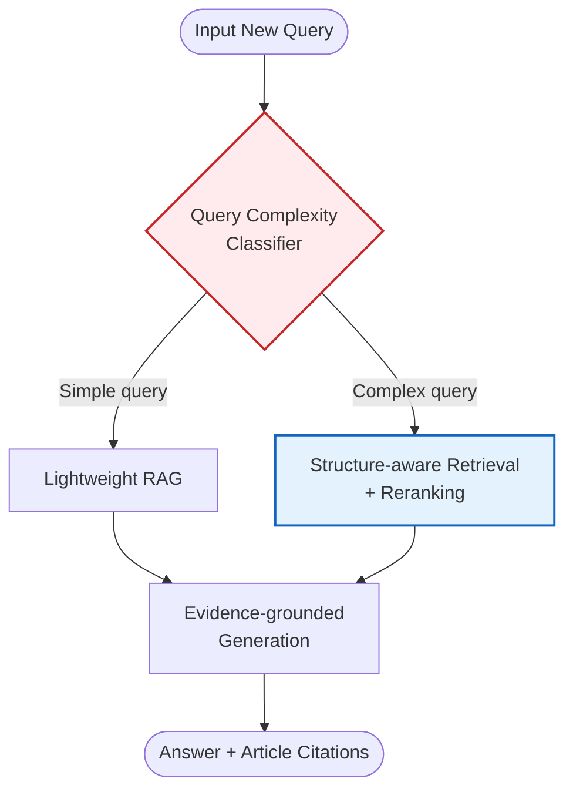
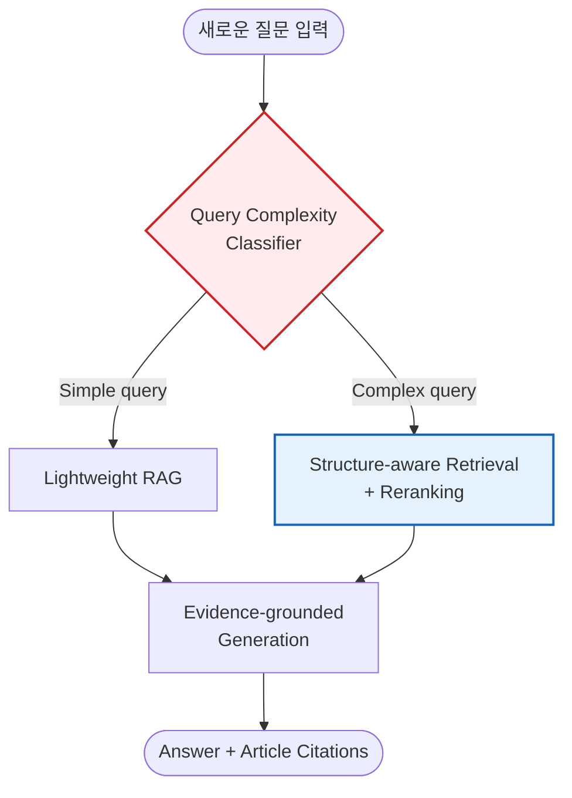

# Structure-Aware Adaptive RAG for University Academic Regulations

This document is a guide containing the slide layout and script for the "Structure-Aware Adaptive RAG for Academic Regulations Q&A" presentation requested by the user. Considering the short presentation time, the visual layout has been structured so that the **3 core sentences** are clearly imprinted on the audience.

> [!IMPORTANT]
> **3 Core Presentation Points (To be emphasized throughout the presentation)**
> 1. Academic regulations are **structured documents** with complex connection relations.
> 2. **Standard RAG** relying on simple search **is insufficient**.
> 3. To solve this, **structure-aware retrieval + document complexity-based adaptive routing** is necessary.

---

## Slide 1. Title / Problem Setting

**[ Visual & Layout Guide ]**
* **Layout**: Along with a center-aligned title, place the 'Core Question' in a prominent box (applying a point color) at the bottom or right side of the slide to draw the audience's attention.
* **Design Point**: Reduce text and arrange mainly with keywords. Briefly diagramming the flow of 'Limitation Analysis' ➡️ 'Structure Reflection' ➡️ 'Adaptive Routing' using arrows is recommended.

**[ Slide Content ]**
### Structure-Aware Adaptive RAG for University Academic Regulations

**Research Objectives**
* Analysis of limitations of standard RAG in academic regulations QA
* Proposal of structure-reflective Retrieval
* Proposal of adaptive routing based on query complexity

> 💡 **Core Question**
> "In documents with many structures and exceptions like academic regulations, is it okay to search all questions the same way?"

**[ Presentation Script ]**
In this project, I propose a Structure-Aware Adaptive RAG for Q&A on academic regulations.
The problem statement is simple. Academic regulations are structured documents with many articles, paragraphs, subparagraphs, exceptions, and reference relations, but existing standard RAG does not adequately reflect this structure. Furthermore, applying the same retrieval strategy to all questions can be inefficient for simple questions and insufficient for difficult ones. Recent legal/policy RAG studies also point out these limitations and demonstrate the need for adaptive and hybrid retrieval.

---

## Slide 2. Why Academic Regulations Are Hard

**[ Visual & Layout Guide ]**
* **Layout**: Split the screen into 2 columns. Visualize the left (Example questions) with speech bubbles or Q&A cards, and show the reasons why these examples are difficult on the right (Difficulty) using connecting lines (lines or arrows).
* **Design Point**: Visually appeal to the first core point, "the structure is complex (academic regulations are structured documents)," by placing complex cobweb icons or tangled document images in the background or margins.

**[ Slide Content ]**
### Why is this problem hard?

**Example questions**
* Can a student on academic probation apply for a double major?
* Is it possible to take seasonal semesters while on a leave of absence?
* Can a student graduate exceptionally without fulfilling graduation requirements?

**Difficulty**
* ⚠️ Looking at only one article is not enough
* ⚠️ Connection to exception clauses / enforcement bylaws / related regulations is necessary
* ⚠️ Evidence clauses are as important as the answer itself

**[ Presentation Script ]**
Questions about academic regulations may seem simple on the surface, but they are actually difficult. For example, the question "Can a student on academic probation apply for a double major?" may require checking not only the double major regulations but also the academic probation regulations, application qualifications, and exception clauses together.
In other words, this problem is not simple document retrieval, but a reasoning-heavy retrieval problem that connects multiple clauses. Recent legal retrieval benchmarks also explain that realistic legal/regulatory queries are exactly this kind of complex retrieval problem.

---

## Slide 3. Limitations of Existing Methods

**[ Visual & Layout Guide ]**
* **Layout**: Place the three limitations side-by-side in 3 columns or parallel boxes to make comparison easy.
* **Design Point**: Deliver the second core point, "Standard RAG alone is insufficient," intuitively by adding a red cross (❌) icon or a warning symbol to the fatal flaw of each methodology.

**[ Slide Content ]**
### Limitations of Existing Methods

1. **LLM only**
   * Hallucination occurrence
   * Outdated knowledge limitation
   * No reliable citation (Lack of reliability)
2. **Standard RAG**
   * Limitations of chunk-level top-k retrieval
   * Weak handling of article hierarchy and exceptions
   * Too much context can hurt answer quality
3. **One-size-fits-all pipeline**
   * Easy queries: Overkill (Inefficient)
   * Hard queries: Insufficient (Lack of information)

**[ Presentation Script ]**
There are three limitations to existing methods.
First, using only an LLM without retrieval suffers from lack of recency and significant hallucination problems.
Second, standard RAG retrieves documents, but since it usually relies on chunk-level top-k retrieval, it fails to adequately reflect article hierarchy or exception structures.
Third, applying the same pipeline to all queries can be slow for easy questions and lacking for hard ones. This is exactly why HyPA-RAG combined a query complexity classifier and hybrid retrieval in the legal/policy domain. Also, regulatory compliance RAG research shows that reranker and context-aware chunking are crucial for performance.

---

## Slide 4. Proposed Idea

**[ Visual & Layout Guide ]**
* **Layout**: Place a large flowchart showing the entire pipeline in the center. In the bottom right, insert specific methods of structure-aware retrieval in a checklist format.
* **Design Point**: Use highlight colors on the Classifier and Structure-aware parts to emphasize the third core point, "structure-aware retrieval + adaptive routing". Inserting the diagram below is recommended.

**[ Slide Content ]**
### Proposed Idea: Structure-Aware Adaptive RAG

**Structure-aware retrieval**
* Parsing by article / paragraph / subparagraph units
* Connecting hierarchical levels
* Connecting reference relations
* Tagging exception clauses

**[ Presentation Script ]**
The method I propose combines two ideas.
First is structure-aware retrieval. Academic regulations are parsed not as simple chunks but by units of articles, paragraphs, and subparagraphs, and retrieval is performed using hierarchical relationships, reference relations, and exception clause information.
Second is adaptive routing. After classifying the complexity of the question, simple questions are handled with lightweight RAG, while complex questions are processed with structure-based retrieval and reranking. This design adapts the adaptive retrieval idea of HyPA-RAG and the reranking/chunking design of compliance RAG to fit the academic regulations domain.

---

## Slide 5. Experiment Plan

**[ Visual & Layout Guide ]**
* **Layout**: Divide the screen into 3 parts or form 3 cards to improve readability.
    * Left: Blue-toned icons (Dataset)
    * Center: Orange-toned icons (Question Types)
    * Right: Highlight color for the proposed model only among gray tones (Baselines)

**[ Slide Content ]**
### Experiment Plan

**1️⃣ Dataset**
* School rules / Course registration regulations
* Scholarship regulations / Graduation regulations
* Leave of absence & reinstatement regulations / Double & minor major regulations

**2️⃣ Question types**
* Simple factual
* Clause combination
* Exception interpretation
* Application judgment

**3️⃣ Baselines**
* LLM only
* Dense RAG
* Dense + Reranker
* Hybrid RAG
* 🌟 **Ours: Structure-aware Adaptive RAG**

**[ Presentation Script ]**
The experiment will be conducted by collecting major academic documents such as school rules, course registration regulations, scholarship regulations, and graduation regulations.
Question types are planned to be divided into simple factual, clause combination, exception interpretation, and application judgment types. Baselines will include LLM only (without retrieval), dense RAG, dense + reranker, and hybrid RAG, and finally compared with the proposed model, structure-aware adaptive RAG. This query type categorization aligns well with the problem design of reasoning-focused legal retrieval benchmarks, and the reranking baseline reflects the results of compliance RAG research.

---

## Slide 6. Evaluation / Expected Contribution

**[ Visual & Layout Guide ]**
* **Layout**: Place evaluation metrics and research questions at the top, and Expected Contribution largely at the bottom. Insert References in small, faint text at the very bottom margin of the slide.

**[ Slide Content ]**
### Evaluation and Expected Contribution

**📊 Evaluation Metrics**
* Answer Accuracy / F1 
* Retrieval Recall@k
* Citation Correctness
* Latency & Token / Cost

**❓ Research Questions**
* Does structure-aware retrieval improve accuracy?
* Does adaptive routing reduce latency?
* For which question types is the effect greatest?

**✨ Expected Contribution**
1. Proposition of a realistic experimental frame for academic regulations QA
2. Empirical effect analysis of **structure-based retrieval**
3. Verification of the efficiency of **Adaptive RAG**

---

<b>References</b>
 - Kalra et al., 2025. HyPA-RAG: A Hybrid Parameter Adaptive Retrieval-Augmented Generation System for AI Legal and Policy Applications.
 - Umar et al., 2025. Enhancing Regulatory Compliance Through Automated Retrieval, Reranking, and Answer Generation.
 - Zheng et al., 2025. A Reasoning-Focused Legal Retrieval Benchmark.

**[ Presentation Script ]**
Evaluation will consider not only answer accuracy but also retrieval recall, citation correctness, latency, and token usage. Through this, we can verify whether structure-aware retrieval actually creates more accurate evidence-based answers, and whether adaptive routing improves efficiency.

There are three expected contributions.
First, proposing a realistic experimental frame for academic regulation QA.
Second, conducting an empirical analysis of the effects of structure-based retrieval.
Third, verifying the efficiency of adaptive RAG, which connects with the research trend in legal/policy RAG.
Recent studies show that retrieval remains a difficult problem in the legal/policy domain, and that adaptive/hybrid retrieval is a promising direction. A well-constructed academic regulations RAG will be an excellent instance proving this. Thank you for listening.

   
---
# [한국어 원본 / Korean Version]
---

# Structure-Aware Adaptive RAG for University Academic Regulations

본 문서는 사용자가 요청한 "학사 규정 질의응답을 위한 Structure-Aware Adaptive RAG" 발표를 위한 슬라이드 구성안과 대본을 담은 가이드 문서입니다. 발표 시간이 짧은 점을 감안하여 **핵심 3문장**이 청중에게 명확히 각인될 수 있도록 시각적 배치를 구성했습니다.

> [!IMPORTANT]
> **발표 핵심 3포인트 (발표 내내 강조할 내용)**
> 1. 학사 규정은 연결 관계가 복잡한 **구조적 문서**다.
> 2. 단순 검색에 의존하는 **일반 RAG만으로는 부족**하다.
> 3. 이를 해결하기 위해 **구조 인식 retrieval + 문서 복잡도 기반 adaptive routing**이 필요하다.

---

## Slide 1. Title / Problem Setting

**[ 시각 자료 및 레이아웃 가이드 ]**
* **레이아웃**: 중앙 정렬의 타이틀과 함께, 슬라이드 하단 또는 우측에 '핵심 질문'을 눈에 띄는 박스(포인트 컬러 적용)로 배치하여 청중의 이목을 집중시킵니다.
* **디자인 포인트**: 텍스트를 줄이고 키워드 위주로 배치. '한계 분석' ➡️ '구조 반영' ➡️ 'Adaptive Routing' 의 흐름을 화살표로 간단히 도식화해도 좋습니다.

**[ 슬라이드 화면 내용 ]**
### Structure-Aware Adaptive RAG for University Academic Regulations

**연구 목표**
* 학사 규정 QA에서 일반 RAG의 한계 분석
* 조항 구조를 반영한 Retrieval 제안
* 질의 복잡도 기반 Adaptive Routing 제안

> 💡 **핵심 질문**
> "학사 규정처럼 구조와 예외가 많은 문서에서, 모든 질문을 같은 방식으로 검색해도 괜찮은가?"

**[ 발표 대본 ]**
안녕하세요. 저는 이번 프로젝트에서 학사 규정 질의응답을 위한 Structure-Aware Adaptive RAG를 제안합니다.
문제의식은 간단합니다. 학사 규정은 조항, 항, 호, 예외, 참조 관계가 많은 구조적 문서인데, 기존의 일반 RAG는 이런 구조를 충분히 반영하지 못합니다. 또한 모든 질문에 동일한 retrieval 전략을 적용하면 쉬운 질문에는 비효율적이고, 어려운 질문에는 불충분할 수 있습니다. 최근 legal/policy RAG 연구도 이런 한계를 지적하며 adaptive retrieval과 hybrid retrieval의 필요성을 보여주고 있습니다.

---

## Slide 2. Why Academic Regulations Are Hard

**[ 시각 자료 및 레이아웃 가이드 ]**
* **레이아웃**: 화면을 좌우 2단으로 분할. 좌측(Example questions)은 말풍선이나 Q&A 카드로 시각화하고, 우측(Difficulty)은 왜 이 예시들이 어려운지에 대한 이유를 연결선(선 또는 화살표)으로 보여줍니다.
* **디자인 포인트**: 복잡한 거미줄 형태의 아이콘이나 얽힌 문서 이미지를 배경이나 여백에 배치하여 "구조가 복잡하다(학사 규정은 구조적 문서다)"는 1번 핵심 포인트를 시각적으로 어필합니다.

**[ 슬라이드 화면 내용 ]**
### Why is this problem hard?

**Example questions**
* 학사경고를 받은 학생도 복수전공 신청이 가능한가?
* 휴학 중 계절학기 수강이 가능한가?
* 졸업 요건을 못 채웠는데 예외적으로 졸업 가능한가?

**Difficulty**
* ⚠️ 한 조항만 보면 안 됨
* ⚠️ 예외 조항 / 시행세칙 / 관련 규정 연결 필요
* ⚠️ 답변뿐 아니라 근거 조항도 중요

**[ 발표 대본 ]**
학사 규정 질문은 겉보기에는 단순해 보이지만 실제로는 어렵습니다. 예를 들어 “학사경고를 받은 학생도 복수전공 신청이 가능한가?”라는 질문은 복수전공 규정만이 아니라 학사경고 규정, 신청 자격, 예외 조항까지 함께 확인해야 할 수 있습니다. 
즉, 이 문제는 단순 문서 검색이 아니라 여러 조항을 연결하는 reasoning-heavy retrieval 문제입니다. 최근 legal retrieval benchmark도 현실적인 법률·규정 질의가 바로 이런 식의 복잡한 retrieval 문제라고 설명합니다.

---

## Slide 3. Limitations of Existing Methods

**[ 시각 자료 및 레이아웃 가이드 ]**
* **레이아웃**: 세 가지 한계점을 3개의 열(Column)이나 병렬 박스로 나란히 배치하여 비교하기 쉽게 만듭니다.
* **디자인 포인트**: 각 방법론의 치명적인 단점에 빨간색 엑스(❌) 아이콘이나 경고 기호를 달아 "일반 RAG만으로는 부족하다"는 2번 핵심 포인트를 직관적으로 전달합니다.

**[ 슬라이드 화면 내용 ]**
### Limitations of Existing Methods

1. **LLM only**
   * Hallucination 발생
   * Outdated knowledge 한계
   * No reliable citation (신뢰성 부족)
2. **Standard RAG**
   * Chunk-level top-k retrieval의 한계
   * Weak handling of article hierarchy and exceptions
   * Too much context can hurt answer quality
3. **One-size-fits-all pipeline**
   * 쉬운 질문 (Easy queries): Overkill (비효율적)
   * 어려운 질문 (Hard queries): Insufficient (정보 부족)

**[ 발표 대본 ]**
기존 방법의 한계는 세 가지입니다.
첫째, retrieval 없이 LLM만 쓰면 최신성 부족과 hallucination 문제가 큽니다. 
둘째, standard RAG는 문서를 검색해 오지만 보통 chunk 단위 top-k retrieval에 의존하기 때문에 조항 계층이나 예외 구조를 충분히 반영하지 못합니다. 
셋째, 모든 질문에 같은 pipeline을 적용하면 쉬운 질문엔 느리고, 어려운 질문엔 부족할 수 있습니다. HyPA-RAG는 legal/policy 도메인에서 query complexity classifier와 hybrid retrieval을 결합한 이유가 바로 여기에 있다고 설명합니다. 또 regulatory compliance RAG 연구는 reranker와 context-aware chunking이 성능에 중요하다고 보여줍니다.

---

## Slide 4. Proposed Idea

**[ 시각 자료 및 레이아웃 가이드 ]**
* **레이아웃**: 중앙에 전체 파이프라인을 보여주는 순서도(Flowchart)를 큼직하게 배치합니다. 우측 하단에는 Structure-aware retrieval의 구체적 방법들을 체크리스트 형태로 넣습니다.
* **디자인 포인트**: 3번 핵심 포인트인 "구조 인식 retrieval + adaptive routing"을 강조하기 위해 분기점(Classifier) 부분과 구조 인식(Structure-aware) 부분에 강조색을 사용합니다. 아래의 다이어그램을 삽입하는 것을 추천합니다.

**[ 슬라이드 화면 내용 ]**
### Proposed Idea: Structure-Aware Adaptive RAG

**Structure-aware retrieval**
* 조 / 항 / 호 단위 파싱
* 상하위 계층 연결
* 참조 관계 연결
* 예외 조항 태깅

**[ 발표 대본 ]**
제가 제안하는 방법은 두 아이디어를 결합한 것입니다.
첫째, structure-aware retrieval입니다. 학사 규정을 단순 chunk가 아니라 조, 항, 호 단위로 파싱하고, 상하위 계층과 참조 관계, 예외 조항 정보를 활용해 retrieval을 수행합니다. 
둘째, adaptive routing입니다. 질문의 복잡도를 먼저 분류한 뒤, 단순한 질문은 가벼운 RAG로 처리하고, 복잡한 질문은 구조 기반 retrieval과 reranking을 적용합니다. 이 설계는 HyPA-RAG의 adaptive retrieval 아이디어와 compliance RAG의 reranking·chunking 설계를 학사 규정 도메인에 맞게 결합한 것입니다.

---

## Slide 5. Experiment Plan

**[ 시각 자료 및 레이아웃 가이드 ]**
* **레이아웃**: 화면을 3등분 하거나 3개의 카드 형태로 구성하여 가독성을 높입니다. 
    * 좌측: 파란색 계열 아이콘 (Dataset)
    * 중앙: 주황색 계열 아이콘 (Question Types)
    * 우측: 회색 계열에서 제안 모델만 강조색 (Baselines)

**[ 슬라이드 화면 내용 ]**
### Experiment Plan

**1️⃣ Dataset**
* 학칙 / 수강 규정
* 장학 규정 / 졸업 규정
* 휴학·복학 규정 / 복수전공·부전공 규정

**2️⃣ Question types**
* 단순 사실형
* 조항 결합형
* 예외 해석형
* 적용 판단형

**3️⃣ Baselines**
* LLM only
* Dense RAG
* Dense + Reranker
* Hybrid RAG
* 🌟 **Ours: Structure-aware Adaptive RAG**

**[ 발표 대본 ]**
실험은 학칙, 수강 규정, 장학 규정, 졸업 규정 등 주요 학사 문서를 수집해 진행할 예정입니다.
질문 유형은 단순 사실형, 조항 결합형, 예외 해석형, 적용 판단형으로 나눌 계획입니다. 비교군은 retrieval이 없는 LLM only, dense RAG, dense + reranker, hybrid RAG를 두고, 최종적으로 제안 모델인 structure-aware adaptive RAG와 비교합니다. 이런 질의 유형 구분은 reasoning-focused legal retrieval benchmark의 문제 설계와도 잘 맞고, reranking baseline은 compliance RAG 연구 결과를 반영한 것입니다.

---

## Slide 6. Evaluation / Expected Contribution

**[ 시각 자료 및 레이아웃 가이드 ]**
* **레이아웃**: 상단에 평가 지표와 연구 질문을 배치하고, 하단에 크게 Expected Contribution을 배치합니다. 슬라이드의 제일 밑바닥 여백에는 흐린 텍스트로 References를 작게 삽입합니다.

**[ 슬라이드 화면 내용 ]**
### Evaluation and Expected Contribution

**📊 Evaluation Metrics**
* Answer Accuracy / F1 
* Retrieval Recall@k
* Citation Correctness
* Latency & Token / Cost

**❓ Research Questions**
* 구조 인식 retrieval이 정확도를 높이는가?
* Adaptive routing이 latency를 줄이는가?
* 어떤 질문 유형에서 효과가 가장 큰가?

**✨ Expected Contribution**
1. 학사 규정 QA용 실험 프레임 제안
2. **구조 기반 retrieval**의 실증적 효과 분석
3. **Adaptive RAG**의 효율성 검증

---

<b>References</b>
 - Kalra et al., 2025. HyPA-RAG: A Hybrid Parameter Adaptive Retrieval-Augmented Generation System for AI Legal and Policy Applications.
 - Umar et al., 2025. Enhancing Regulatory Compliance Through Automated Retrieval, Reranking, and Answer Generation.
 - Zheng et al., 2025. A Reasoning-Focused Legal Retrieval Benchmark.

**[ 발표 대본 ]**
평가는 정답 정확도만이 아니라 retrieval recall, citation correctness, latency, token usage까지 함께 볼 예정입니다. 이를 통해 구조 인식 retrieval이 실제로 더 정확한 근거 기반 답변을 만드는지, 그리고 adaptive routing이 효율성을 높이는지 검증할 수 있습니다. 

기대 기여는 세 가지입니다. 
첫째, 학사 규정 QA를 위한 현실적인 실험 프레임을 제안하는 것.
둘째, 구조 기반 retrieval의 효과 실증적인 효과 분석하는 것.
셋째, legal/policy RAG 연구 흐름과 연결되는 adaptive RAG의 효율성을 검증하는 것입니다. 
최근 연구들은 legal/policy 도메인에서 retrieval이 여전히 어려운 문제이며, adaptive/hybrid retrieval이 유망한 방향임을 보여주고 있습니다. 잘 구축된 학사 규정 RAG는 이를 증명하는 훌륭한 사례가 될 것입니다. 발표 들어주셔서 감사합니다.
