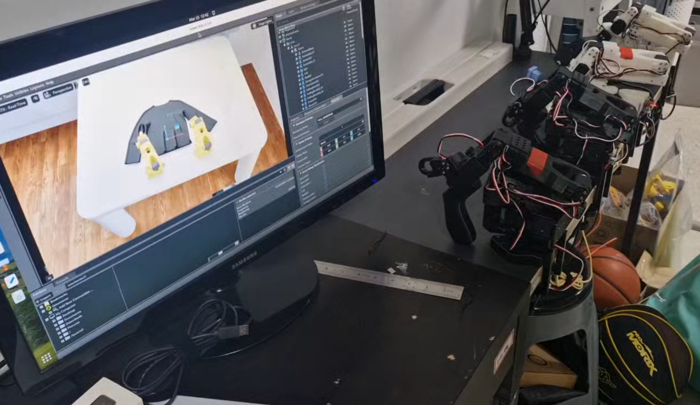
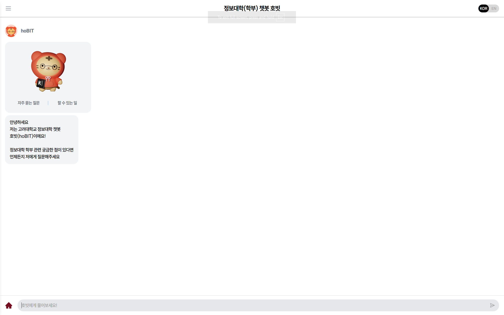

# Supplementary Materials

---

## Slide 1. Supplementary Comparison: MS-VLA vs RAG System

**[ Visual & Layout Guide ]**
* **Layout**: One slide with (1) title row, (2) two-column figure comparison, (3) short takeaway row.
* **Design Point**: Keep left and right image sizes identical for fair visual comparison, and add one-line interpretation under each figure.
* **Design Point**: Put the final takeaway in a highlighted box at the bottom so the audience leaves with a clear message.

**[ Slide Content ]**
### Visual Comparison of System Designs

<table style="width:100%; border-collapse:collapse;">
  <tr>
    <td style="width:50%; padding:8px; vertical-align:top;">
      
      
<b>MS-VLA</b>

      
Set Robot Environment

    </td>
    <td style="width:50%; padding:8px; vertical-align:top;">
      
      
<b>RAG System</b>

      
Deploying QA Service

    </td>
  </tr>
</table>

**Key Observations**
* MS-VLA emphasizes ambiguity-aware action control in multimodal execution.
* Structure-aware RAG emphasizes evidence tracing and citation-grounded response quality.
* The two systems target different failure points and can be viewed as complementary.

<b>Takeaway:</b> The supplementary figures show why we separate ambiguity-aware control (MS-VLA) from structure-aware evidence retrieval (RAG), while aligning both under reliability-focused decision support.

**[ Presentation Script ]**
This supplementary slide compares the two system designs side by side.  
On the left, MS-VLA focuses on handling ambiguous instructions during execution through steering and clarification.  
On the right, the RAG system focuses on retrieving structured evidence and generating citation-grounded answers.  
The key point is that they solve different reliability problems, so they should be interpreted as complementary components rather than competing alternatives.
